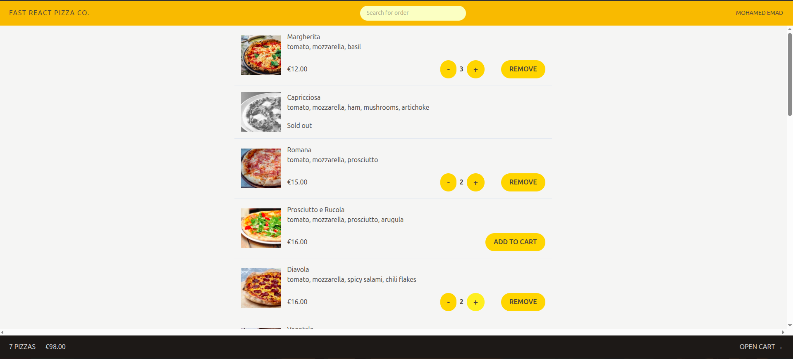
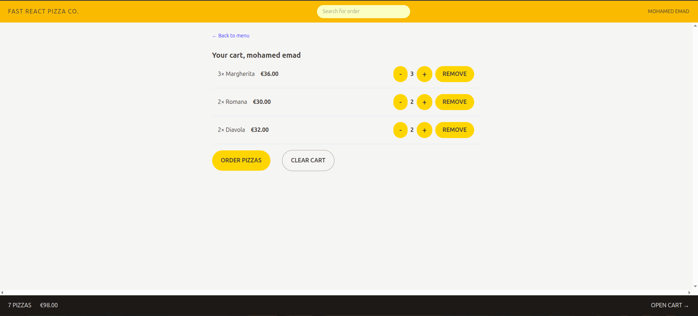
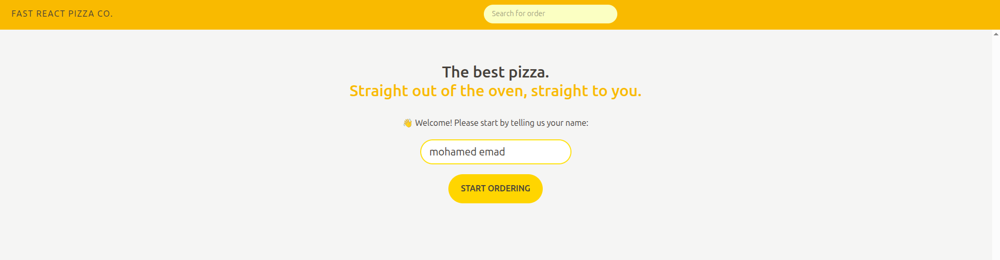
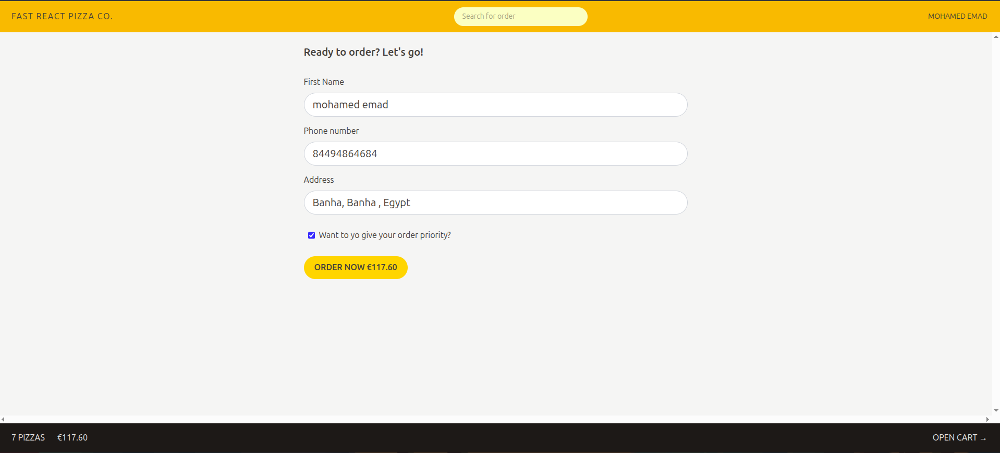
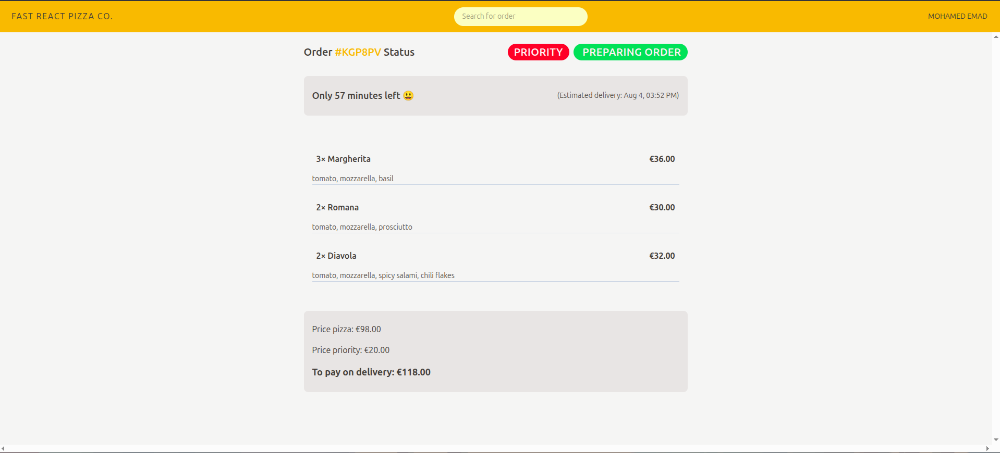

# 🍕 Fast React Pizza

A modern pizza ordering web app built with React, Redux Toolkit, and Vite. Enjoy a seamless experience from browsing the menu to tracking your order!

---

## Features

- **Browse Menu:** View a list of delicious pizzas with images, ingredients, and prices.
  

- **Add to Cart:** Add pizzas to your cart, update quantities, or remove items.
  

- **User Authentication:** Enter your name to personalize your experience.
  

- **Order Creation:** Fill out your details, select priority, and place your order.
  

- **Order Tracking:** Track your order status and estimated delivery time.
  

- **Responsive Design:** Fully responsive and mobile-friendly UI.

- **Geolocation:** Autofill your address using your current location.

- **Error Handling:** Friendly error messages and loading indicators.

---

## Technologies Used

- **React 19** with functional components and hooks
- **Redux Toolkit** for state management
- **React Router v7** for routing and data loading
- **Vite** for fast development and build
- **Tailwind CSS** for utility-first styling
- **ESLint & Prettier** for code quality and formatting
- **Async/Await** for API calls
- **Custom Loader & Error UI** components

---

## Getting Started

1. **Install dependencies:**
   ```sh
   npm install
   ```
